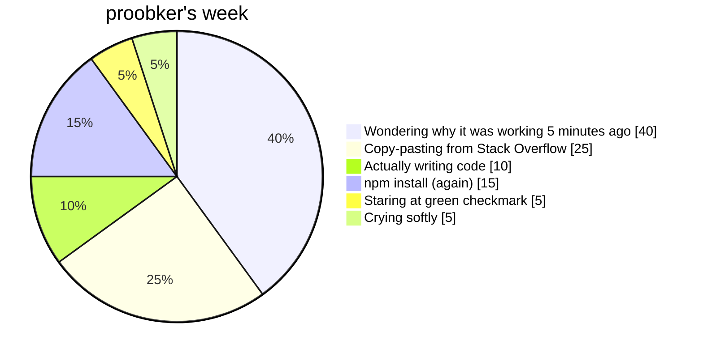
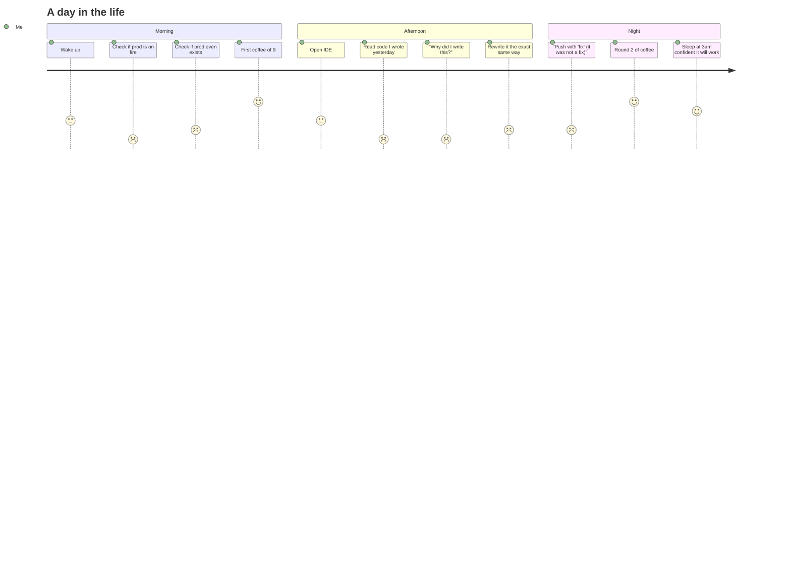
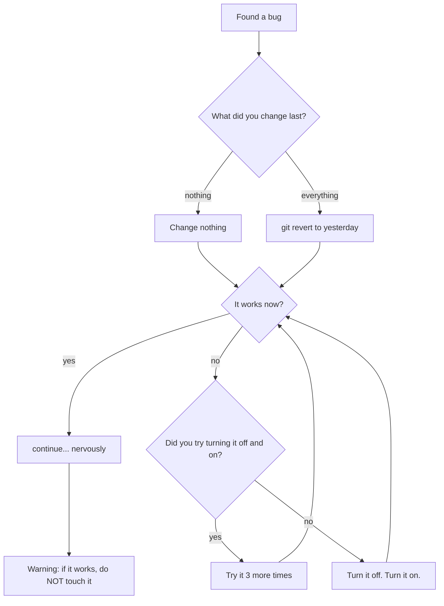
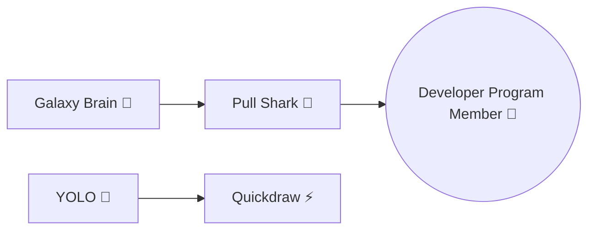

<p align="center">
  
</p>

```text
        ██████╗ ██████╗  ██████╗  ██████╗ ██████╗ ██╗  ██╗███████╗██████╗ 
        ██╔══██╗██╔══██╗██╔═══██╗██╔═══██╗██╔══██╗██║ ██╔╝██╔════╝██╔══██╗
        ██████╔╝██████╔╝██║   ██║██║   ██║██████╔╝█████╔╝ █████╗  ██████╔╝
        ██╔═══╝ ██╔══██╗██║   ██║██║   ██║██╔══██╗██╔═██╗ ██╔══╝  ██╔══██╗
        ██║     ██║  ██║╚██████╔╝╚██████╔╝██████╔╝██║  ██╗███████╗██║  ██║
        ╚═╝     ╚═╝  ╚═╝ ╚═════╝  ╚═════╝ ╚═════╝ ╚═╝  ╚═╝╚══════╝╚═╝  ╚═╝
                                                                  
          ═══════════════════════ SERVER: OK ──────────────────────────
          ═══════════════════ MOTIVATION: OFFLINE ─────────────────────
          ══════════════════ BRAIN: 3% (SEARCHING...) ────────────────
          ═════════════════ COFFEE LEVEL: CRITICAL ────────────────────
          ═══════════════ GITHUB STREAK: DEAD ON ARRIVAL ──────────────
          ═════════════════════ initializing proobker v1.0 ────────────
          ═══════════════════════════ nothing to see here 🙃 ──────────
```

<p align="center">
  <a href="https://github.com/proobker"></a>
  <a href="https://github.com/proobker?tab=followers"></a>
  <a href="#"></a>
  <a href="#"></a>
  <a href="#"></a>
  <a href="#"></a>
</p>

---

### 📡 status

```json
{
  "name": "proobker",
  "legal_name": "Rabi Dahal",
  "bio": "🙃 Just a normal guy.",
  "location": "Bhaktapur, Nepal 🇳🇵",
  "timezone": "UTC+5:45 (yes we have an extra 45 minutes, no you can't have some)",
  "followers": "9 (3 of them are roommates, 6 are bills)",
  "following": "3 (only the essentials)",
  "bugs_shipped": "all of them",
  "fixed": "none of them",
  "production_ready": false,
  "works_on_machine": true,
  "coffee": "Infinity (see graph below)",
  "status": "I am a Great Guy ✌️"
}
```

---

### 📊 "my stats" (I am contractually obligated to show these)

> [!IMPORTANT]
> I am a <mark>Great Guy</mark>. These numbers are accurate. The captions are not.

<p align="center">
  
  
</p>

<p align="center">
  
</p>

<sub>Yes the top-langs card is mostly my `node_modules`. Yes that's still a skill.</sub>

---

### ⏳ how my week actually goes



### 🚶 a day in the life of a *normal guy*



### 🐛 how I fix a bug



---

### 🛠️ the skill set (heavily inflated)

| Skill | Proficiency | Honest rating |
| --- | --- | --- |
| TypeScript | Writes `any` and prays | 🥉 |
| Kotlin | Gradle's therapist | 🥉 |
| Python | `print("it works")` level | 🥈 |
| JavaScript | 1.5 frameworks worth | 🥉 |
| CSS | `color: blue` and nothing else | 🥈 |
| Git | `--force` daily driver | 🥇 |
| Debugging | `console.log` enjoyer | 🥉 |
| Googling the error | Elite | 🥇 |

<sup>Medals are self-awarded. Appeals will be ignored.</sup>

---

### 📦 my pinned repos (I refuse to be serious) [^1]

<details>
  <summary><b>rakshya_app</b> — protects women, and also my reputation 🛡️</summary>

  A women's safety app built in **TypeScript**. Features include SOS, safe places, and a "panic on purpose" button.
  If you see it on your screen, I'm legally responsible for what I say next: *it works on my machine*.

  <p align="center">
    
    
  </p>
</details>

<details>
  <summary><b>qst</b> — turning real life into an RPG so I can finally win at something 🎮</summary>

  An AI-driven quest game: hobbies + location + proof uploads = XP and badges.
  I'm basically the DM of my own life now. Critical hit: getting out of bed.

  <p align="center">
    
    
  </p>
</details>

<details>
  <summary><b>rakshyaa</b> — v2, now with more Kotlin and fewer crashes (allegedly) 🚀</summary>

  V2 of the women's safety app. Built in **Kotlin** — which means I spent 40% of the time in Gradle config purgatory.
  The other 60%: writing comments about how the safety app keeps me safe from `null` pointer exceptions.

  <p align="center">
    
    
  </p>
</details>

<details>
  <summary><b>rubiks-solver</b> — looks like a magic cube, is actually a tutorial gucci 🧊</summary>

  A web guide that teaches you to solve a Rubik's cube. Great for the 3 people who ever asked me if I can
  solve one. Answer: no. But I can open this website faster than you.

  <p align="center">
    
    
  </p>
</details>

<details>
  <summary>💳 the real links (I stopped joking for exactly 5 lines)</summary>

  - 🌐 Portfolio: [proobker.github.io](https://proobker.github.io)
  - 💼 LinkedIn: [in/rabi-dahal](https://www.linkedin.com/in/rabi-dahal/)
  - 🐙 GitHub: [@proobker](https://github.com/proobker)

  *Scoff. Now back to the bit.*
</details>

[^1]: `pinned` in this context means "I hide them in dropdowns because GitHub only lets me pin 6 and I have trust issues."

---

### 🚨 alert gauntlet (read at your own risk)

> [!CAUTION]
> Do **not** run any of my code in production. Especially the code that says "production-ready".

> [!WARNING]
> This profile is 99% jokes, 1% impostor syndrome. Remaining 0% is real documentation.

> [!NOTE]
> If you're here from my LinkedIn, no you're not. This is a bot. Please hire me anyway.

> [!TIP]
> Buy me a coffee. My entire personality is a side effect of caffeine withdrawals.

---

### 🧮 extremely precise mathematics

$$\color{orange}{\text{bugs}}\ \color{red}{\text{shipped: }} \color{red}{\infty}$$

$$\color{cyan}{\text{willingness to fix them: }} \color{blue}{0.3}$$

$$\color{green}{\text{"it works" confidence: }} \color{green}{0.87}\ \color{gray}{\text{(unverified)}}$$

> [!IMPORTANT]
> $\color{orange}{\text{I am a Great Guy.}}$ This is mathematically proven above. Trust the math.

---

### ✅ today's plan (it's 11:47pm)

- [x] Found motivation
- [ ] Lost motivation
- [ ] Regain motivation
- [ ] Actually open IDE
- [ ] Write feature
- [ ] Find bug
- [ ] Fix bug
- [ ] *Introspect*: why am I like this
- [ ] Push with `fix` anyway 🥇

<kbd>CTRL</kbd> + <kbd>S</kbd> for emotional support (does nothing)

---

### 🏆 achievements (real ones, from GitHub itself. I checked.)



I also unlocked the hidden achievement: **"Pushed during a deadline and nothing broke (once)"**. Requires 1-in-a-million RNG.

<details>
  <summary>🏅 the full trophy case (expand to be impressed)</summary>

  <p align="center">
    
  </p>

  <sub>Each trophy = a moment I Googled a fix and it worked on the first try.</sub>
</details>

---

### 😂 a completely professional joke card


<picture>
  <source media="(prefers-color-scheme: dark)" srcset="./dist/github-contribution-grid-snake-dark.svg" />
  <source media="(prefers-color-scheme: light)" srcset="./dist/github-contribution-grid-snake.svg" />
  
</picture>

---

### 📫 contact (choose your own adventure)

<details>
  <summary>Click here to contact me (this is where I keep the real links)</summary>

  | Where | Link |
  | --- | --- |
  | 🌐 Portfolio | [proobker.github.io](https://proobker.github.io) |
  | 💼 LinkedIn | [in/rabi-dahal](https://www.linkedin.com/in/rabi-dahal/) |
  | 🐙 GitHub | [github.com/proobker](https://github.com/proobker) |
  | 🪲 Report a bug in my life | [Open an issue](https://github.com/proobker/proobker/issues) |

</details>

> [!NOTE]
> if the issue tracker is empty, it means my life is bug-free. finally.

---

<p align="center">
  <b>thats all. youre welcome.</b>
</p>

<p align="center">
  <sub>
    crafted with ☕ · smashed with <kbd>SPACE</kbd> · deployed with ✨ <i>hope</i> ✨
    <br/>made by a <b>normal guy</b> (🙃™)
  </sub>
</p>

<p align="center">
  <a href="https://github.com/proobker/proobker/issues"></a>
</p>

<p align="center">
  
  
  
  
</p>